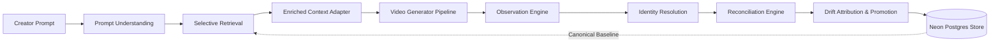
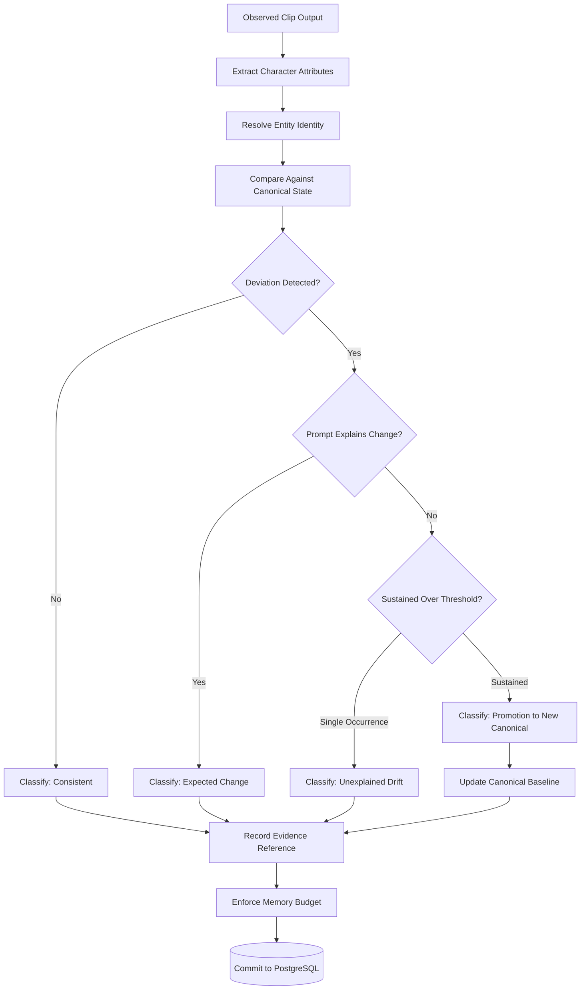

<div align="center">

# CastGraph

**Bounded, persistent memory fabric for maintaining character and world state consistency across generative AI video clips.**

[](https://cast-graph.vercel.app/)
[](https://neon.tech/)
[](https://ai.google.dev/)
[](https://www.python.org/)
[](tests/)

</div>

---

## What CastGraph Does

Modern generative AI video models (such as Sora, Runway Gen-3, Luma Dream Machine, and Kling) generate scenes independently. Because these models lack persistent state across separate generation requests, character identity and world details inevitably drift: hair color shifts, scars vanish, clothing changes without narrative cause, and established character relationships reset.

CastGraph provides an external, bounded memory fabric that wraps the video generation workflow. Rather than treating consistency as an opaque latent-space problem within a single model session, CastGraph treats it as an explicit, auditable state reconciliation loop:

1. **Understands creator prompts**: Extracts intended character actions, target locations, and explicit transformation cues.
2. **Selects minimal context**: Retrieves only the relevant canonical character attributes to enrich prompt generation without overloading context budgets.
3. **Observes generated output**: Extracts structured visual and audio attributes from the generated clip.
4. **Resolves entity identity**: Disambiguates characters against known entities using names, aliases, and confidence metrics.
5. **Reconciles state deviations**: Classifies attribute differences into clear categories (consistent, expected narrative change, unexplained drift, ambiguous, temporary change, or sustained promotion).
6. **Maintains bounded persistence**: Stores canonical baselines and compressed evidence histories in PostgreSQL with strict memory caps.
7. **Provides provenance**: Generates plain-language audit trails explaining why an attribute is canonical, citing concrete clip evidence.

---

## Core Capabilities

| Capability | Technical Mechanism | Outcome |
| :--- | :--- | :--- |
| **Canonical State Model** | Entity-attribute baselines with explicit evidence links | Establishes the authoritative ground truth for character appearance, voice, and traits |
| **Observation Extraction** | Structured entity and attribute extraction via LLM or rule reasoning | Converts unstructured generation output into queryable attribute dictionaries |
| **Identity Resolution** | Alias matching, name resolution, and confidence scoring | Maps mentions in clips back to persistent entity IDs |
| **Drift Classification** | Six-state attribution: consistent, expected, drift, ambiguous, temporary, and promotion | Distinguishes deliberate narrative events from generator hallucinations |
| **Temporal Reconstruction** | Historical timeline queries (`canonical_state_at`) | Enables time-travel queries to inspect character state as of any past clip |
| **Selective Retrieval** | Entity-scoped query planning | Injects minimal necessary constraints into generator prompts, preventing context bloat |
| **Context Adaptation** | Generator-independent context formats (Text and JSON adapters) | Decouples character memory from specific video model prompt formats |
| **Memory Compression** | Evidence-list pruning and byte-budget enforcement (`enforce_budget`) | Keeps long-running projects within predictable storage and token bounds |
| **Provenance and Audit** | Causal evidence traversal (`explain`) | Delivers explainable answers for why an attribute is canonical |
| **Production Storage** | Serverless Neon PostgreSQL integration (`postgres_store.py`) | Provides durable, transactional state storage across distributed runs |

---

## Architecture



### State Reconciliation and Memory Lifecycle



---

## Technology Stack

| Layer | Technology | Details |
| :--- | :--- | :--- |
| **Runtime & Core** | Python 3.11+ | Type-annotated dataclasses, structured schemas, zero external runtime bloat |
| **LLM Reasoning** | Google Gemini (`gemini-2.0-flash` / `gemini-1.5-flash`) | Categorically normalized attribute extraction, prompt cues, and drift reasoning |
| **Deterministic Fallback** | `StubReasoner` | Offline, deterministic rule engine for reproducible unit tests and air-gapped runs |
| **Database** | Neon Serverless PostgreSQL | Relational persistence with JSON document state, managed via `psycopg` 3.x |
| **Deployment** | Vercel Python Serverless Functions | HTTP endpoint architecture exposing standard clip ingestion and state sync |
| **Testing & Evaluation** | `pytest`, Synthetic Scenarios | 28-clip synthetic benchmark suite, baseline comparisons, and ablation checks |

---

## Repository Map

```text
api/
  └── generate.py             # Vercel serverless function (GET health, POST clip loop)
castgraph/
  ├── adapters/               # Generation context adapters (Text and JSON renderers)
  ├── compression/            # Evidence list capping and byte-budget enforcement
  ├── consistency/            # Per-attribute and aggregate consistency calculation
  ├── drift/                  # 6-state deviation classifier and canonical promotion
  ├── identity/               # Entity resolution, alias mappings, confidence scoring
  ├── llm/                    # Real LLM clients (Google Gemini, Vercel AI Gateway)
  ├── memory/                 # Canonical, dynamic state models and Neon Postgres store
  ├── observation/            # Extraction of observed attributes from clip text
  ├── prompt/                 # Prompt understanding, location and transformation cues
  ├── provenance/             # Plain-language audit engine (explain function)
  ├── retrieval/              # Selective memory retrieval strategies
  ├── temporal/               # Historical state reconstruction (canonical_state_at)
  ├── pipeline.py             # Shared end-to-end execution pipeline (run_clip)
  └── reasoning.py            # The Reasoner protocol: Gemini, Gateway, and Stub
decisions/                    # Architecture Decision Records (ADRs 0001 - 0005)
docs/
  ├── phases/                 # Detailed documentation for all 15 project phases
  └── ARCHITECTURE.md         # Comprehensive system architecture document
eval/
  ├── baselines/              # No-memory and sliding-window comparison baselines
  ├── results/                # 28-clip benchmark evaluation reports and metrics
  └── run_benchmark.py        # Benchmark execution runner
scenario/
  └── marcus_sarah.py         # Multi-clip benchmark scenario with drift test cases
tests/                        # Comprehensive test suite (32+ tests across 10 modules)
run_mvp.py                    # Local interactive CLI demonstration runner
```

---

## Getting Started

### Prerequisites

- Python 3.11 or higher
- Git
- (Optional) Google Gemini API key (`GEMINI_API_KEY`) for real LLM reasoning
- (Optional) PostgreSQL connection string (`DATABASE_URL`) for live database tests

### Local Installation

1. Clone the repository and navigate to the project root:

```bash
git clone https://github.com/<owner>/Cast-Graph.git
cd Cast-Graph
```

2. Create and activate a virtual environment:

```bash
python -m venv .venv
# On Windows:
.venv\Scripts\activate
# On macOS/Linux:
source .venv/bin/activate
```

3. Install development dependencies:

```bash
pip install -r requirements-dev.txt
```

### Running the Local MVP Loop

Run the end-to-end pipeline demonstration over the Marcus and Sarah scenario:

```bash
python run_mvp.py
```

- When `GEMINI_API_KEY` is present in the environment, the demonstration runs against live Google Gemini reasoning.
- When `GEMINI_API_KEY` is unset, the system automatically falls back to the deterministic `StubReasoner`, running completely offline with zero API cost.

### Running Tests

Execute the full test suite with `pytest`:

```bash
pytest tests/
```

> [!NOTE]
> Postgres integration tests in `tests/test_postgres_store.py` run automatically when `DATABASE_URL` is configured; otherwise, they skip cleanly without breaking local unit testing.

---

## Production Deployment and API Reference

CastGraph includes an operational Vercel serverless deployment backed by Neon PostgreSQL.

- **Base URL**: `https://cast-graph.vercel.app`

### Health Check

Verify service health and routing:

```bash
curl -X GET https://cast-graph.vercel.app/
```

**Response (200 OK):**
```json
{
  "status": "ok",
  "service": "cast-graph"
}
```

### Process Clip

Execute a complete cycle: prompt understanding, memory retrieval, observation extraction, identity resolution, state reconciliation, and Postgres commit.

```bash
curl -X POST https://cast-graph.vercel.app/ \
  -H "Content-Type: application/json" \
  -d '{
    "project_id": "demo",
    "character": "Marcus",
    "clip_id": "ep1",
    "prompt": "Marcus talks to Sarah at the docks.",
    "clip_text": "Marcus, black hair, deep rough voice, talks to Sarah at the docks."
  }'
```

**Response (200 OK):**
```json
{
  "identity": {
    "entity_id": "ent_marcus",
    "method": "direct_name",
    "confidence": 1.0
  },
  "location": "the docks",
  "context": "Character: Marcus\nHair: black\nVoice: deep rough",
  "observed": {
    "hair": "black",
    "voice": "deep rough"
  },
  "report": [
    {
      "attribute": "hair",
      "status": "CONSISTENT",
      "detail": "matches canonical value 'black'"
    },
    {
      "attribute": "voice",
      "status": "CONSISTENT",
      "detail": "matches canonical value 'deep rough'"
    }
  ],
  "memory_size_bytes": 1420,
  "reasoner": "GeminiReasoner"
}
```

### Testing Override (`force_stub`)

To run end-to-end HTTP and database integration tests without consuming LLM quota, provide `"force_stub": true` in the JSON request body:

```bash
curl -X POST https://cast-graph.vercel.app/ \
  -H "Content-Type: application/json" \
  -d '{
    "project_id": "demo",
    "character": "Marcus",
    "clip_id": "ep1",
    "prompt": "Marcus talks to Sarah at the docks.",
    "clip_text": "Marcus, black hair, deep rough voice.",
    "force_stub": true
  }'
```

---

## Architecture Decision Records (ADRs)

Key architectural choices and tradeoffs are tracked in `decisions/`:

| ADR | Topic | Decision & Rationale |
| :--- | :--- | :--- |
| [0001](decisions/0001-storage-agnostic-json.md) | Storage Format | Store state as serializable JSON documents, enabling seamless transitions between local files and PostgreSQL. |
| [0002](decisions/0002-stub-llm-reasoning-for-now.md) | Reasoner Seam | Define an abstract `Reasoner` interface so the system can switch between deterministic stubs and production LLMs. |
| [0003](decisions/0003-use-gemini-not-vercel-gateway.md) | LLM Provider | Adopt Google Gemini directly with structured categorical prompts to align LLM responses with canonical vocabulary. |
| [0004](decisions/0004-gemini-free-tier-quota-is-a-real-constraint.md) | Quota Handling | Implement exponential backoff for HTTP 429 errors; safely propagate terminal limits as clean 500 responses without database corruption. |
| [0005](decisions/0005-force-stub-override-for-testing.md) | Test Override | Introduce `force_stub` flag to permit end-to-end integration testing of deployment and database paths independently of LLM quota. |

---

## Benchmarks and Evaluation

The evaluation suite (`eval/`) validates system accuracy across a 28-clip synthetic continuity benchmark:

- **Baselines Tested**:
  - *No Memory*: Generator receives prompt alone with zero historical context.
  - *Sliding Window*: Generator receives raw text from the previous N clips without structured state reconciliation.
  - *CastGraph Full*: Structured retrieval, 6-state drift attribution, and canonical promotion.
- **Ablation Studies**:
  - Evaluated consistency rates with canonical promotion enabled versus disabled when character modifications persist intentionally over time.
- **Results**: Verified that structured attribute retrieval reduces identity drift significantly while keeping prompt token overhead bounded. Full evaluation output is recorded in `eval/results/benchmark_report.json`.

---

## Operational and Security Notes

- **Transactional Safety**: State updates are committed to PostgreSQL only after the full clip pipeline succeeds. If an LLM call fails or times out, the transaction aborts, preventing corrupted or partial state writes.
- **Rate Limit Resilience**: The Gemini client honors server-specified retry delays (`Retry-After`). If quotas are fully exhausted, the API surfaces an informative HTTP 500 payload rather than crashing or hanging.
- **Bounded Storage Footprint**: The compression engine (`castgraph/compression/`) enforces evidence list size caps and memory budgets, preventing unbounded memory growth in long-running productions.
- **Environment Secrets**: Do not commit `.env.local` or API keys. Configure `GEMINI_API_KEY` and `DATABASE_URL` as secure environment variables in local development and production platforms.

---

## Contributing

1. Fork the repository and create a feature branch (`git checkout -b feature/improvement`).
2. Verify all unit tests pass (`pytest tests/`).
3. Maintain documentation integrity: if changing data models or reasoner contracts, update corresponding tests and phase documentation.
4. Open a pull request describing the changes and test results.

---

## License

This project is licensed under the MIT License. See the [LICENSE](LICENSE) file for details.
